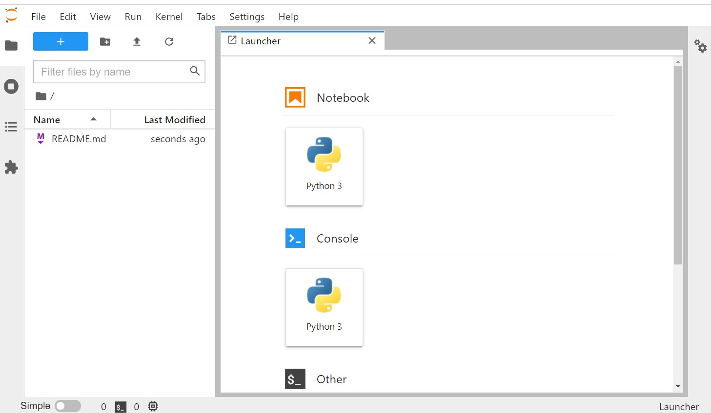
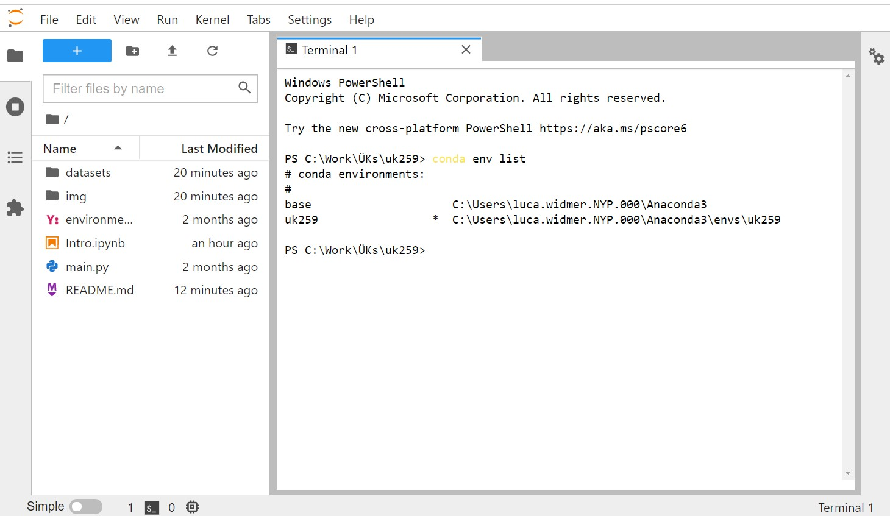

## Install anaconda package manager 
**(Important! Install anaconda in a path without spaces (« »))**

https://docs.anaconda.com/anaconda/install/ 

Help: https://medium.com/@GalarnykMichael/install-python-anaconda-on-windows-2020-f8e188f9a63d 

Test installation by running `conda -V`
## Clone GitHub- Repo 
[Github Repo](https://github.com/LuWidme/uk259)
## Install dependencies in an environment
Navigate to the cloned directory and run:

`conda env create --file environment.yml`

Activate environment:

`conda activate uk259`

The command prompt should have changed to something like this:

`(uk259) C:\Work\ÜKs\259>`

Start **Jupyter-Lab** in the current directory:

`jupyter-lab .`

Your browser should open to a window like this:

In Jupyter-Lab, open a terminal and type:
`conda env list`
Send a screenshot similar to the one below to __ to prove your installation worked
